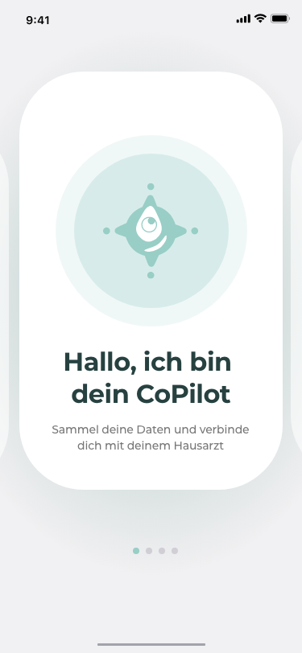
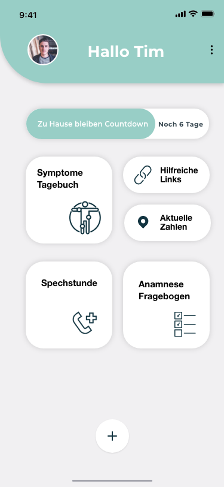
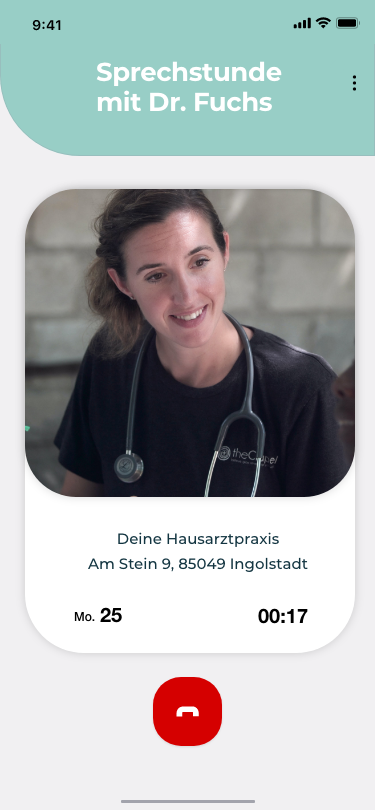
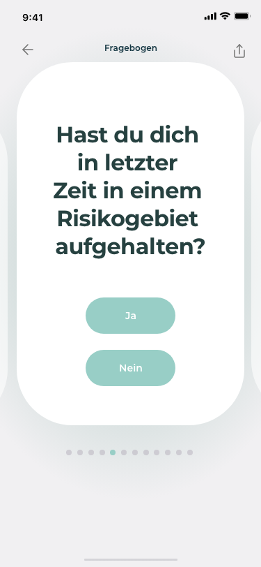
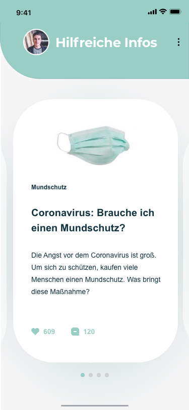
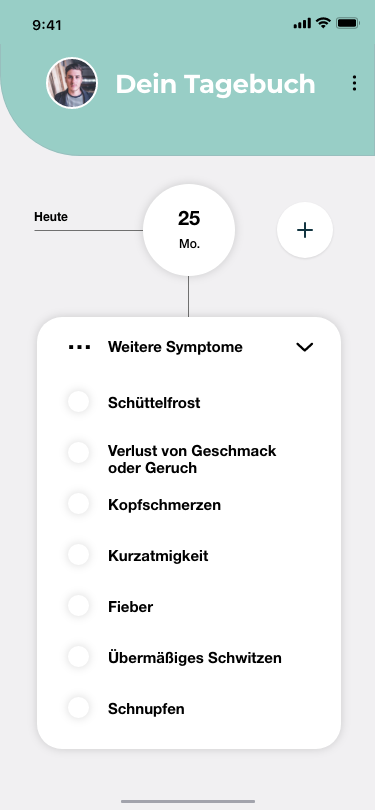

### Was ist CoPilot?

CoPilot ermöglicht dem Arzt eine kontaktlose und effiziente Behandlung. 
CoPilot begleitet den Patienten von der ersten Sorge bis zur Genesung. 
CoPilot. Checkliste. Tagebuch. Monitoring. Alles in einer App.

Die App CoPilot hilft **überlasteten Hausärzten,** Zeit zu sparen und Kontakt zu vermeiden, indem Patienten vorausgefüllte COVID Fragebögen und Symptomverläufe per App erstellen und direkt an den Arzt senden.
Der besorgte oder erkrankte Patient wird durch die App im gesamten
Prozess durch eine umfassende Toolbox (App) zur Information und
Organisation der Gesundheitsdaten interaktiv begleitet. 

Die App-Screens:

Das Projekt CoPilot ist im Hackathon der Bundesregierung #wirvsvirus entstanden und wurde im Wettbewerb sprint4local weiterentwickelt. 

Mehr Infos auf unserer [DevPost-Seite](https://devpost.com/software/copilot-dein-begleiter-fur-deine-gesundheit)

This project was bootstrapped with EXPO

## Available Scripts

In the project directory, you can run:

### `expo start`

You can open the app your phone by downloading the EXPO app, and scanning the QR code from the Metro bundler running in your browser.

